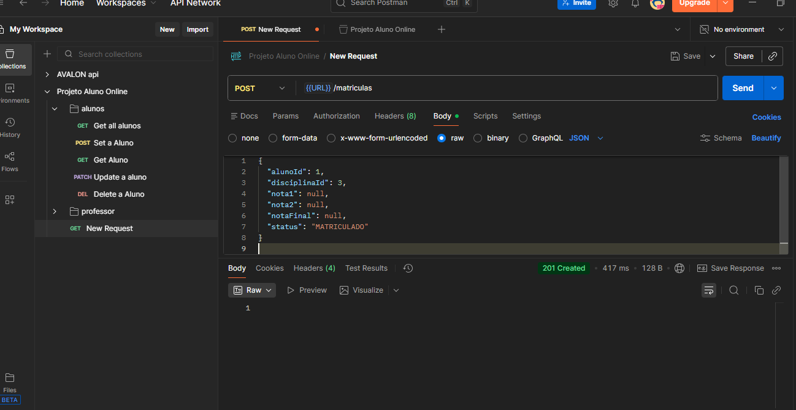
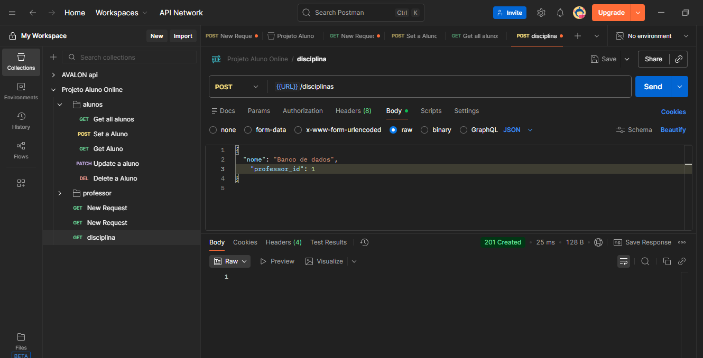
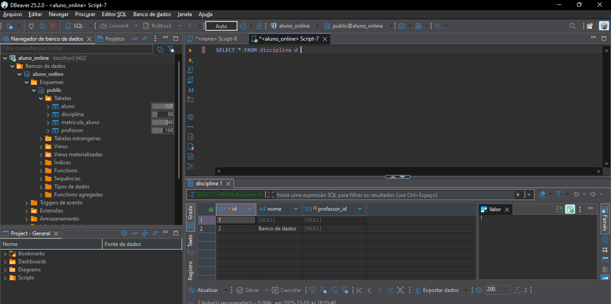
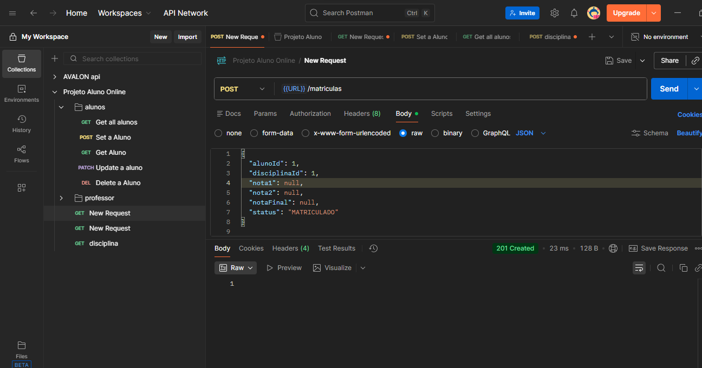

# Aluno_Online
**Diagrama do banco de dados do projeto “Aluno Online”, mostrando as tabelas, relacionamentos e chaves primárias e estrangeiras utilizadas para armazenar informações dos alunos**

